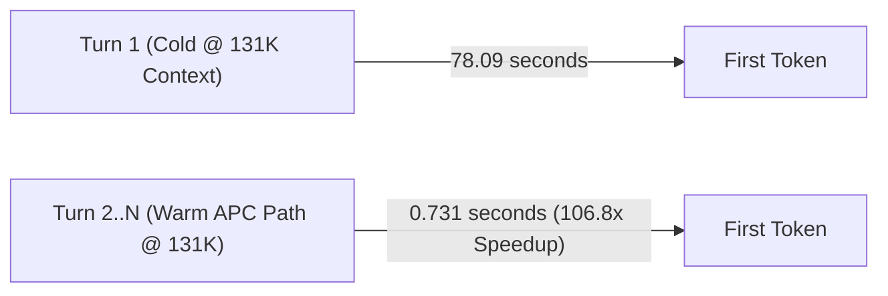

# DeepSeek-V4-Flash on three DGX Sparks

Reproducible deployment notes and benchmark evidence for serving DeepSeek-V4-Flash on
three NVIDIA DGX Spark systems with tensor parallelism (`TP=3`) over a switchless 200 GbE
RoCE ring.

The three-node deployment is working, passes all correctness and quality suites, and is
fully benchmarked with a forced 256-token assertion against matched two-node baselines
under passing fabric gates.

> [!NOTE]
> Older decode runs that requested 256 output tokens but returned only 25–26 (due to prompt
> instructions) have been retired and marked `VOID-25-token-window` in the
> [provenance index](results/INDEX.md). All current numbers use asserted 256-token windows.

## Start here

1. [3-Node vs 2-Node Benchmark](docs/BENCHMARK-2V3-NODES.md) — comprehensive performance
   matrix, context scaling, and architectural analysis.
2. [Current handoff](docs/HANDOFF-2026-08-28.md) — cluster state, verified findings, and
   recipe tuning conclusions.
3. [Documentation index](docs/README.md) — setup, operations, method, decisions, and
   historical investigations.
4. [Results index](results/README.md) — one readable row per frozen run bundle.
5. [Provenance index](results/INDEX.md) — status, gate coverage, raw evidence, and caveats.
6. [Repository and data map](docs/REPOSITORY-MAP.md) — what belongs on GitHub and what
   should stay local.

## The 3-Node Value: Multi-Million Token KV Cache & 100x Warm-Path Speedup

The primary operational value of the 3-node cluster (`TP=3`) is **expanded unified memory**:
- **Multi-Million Token KV Cache Pool**: 3 nodes expand KV capacity to **4,660,501 tokens** under Profile B (`GPU_MEMORY_UTILIZATION=0.835`, `MTP_NUM_TOKENS=2`) per the engine's init log — 4.44x headroom at 1M tokens per request, with zero KV preemption observed in any benchmark bundle to date. (The `/metrics` endpoint reports a lower figure on the same engine; see [Current evidence](#current-evidence).)
- **The Warm Multi-Turn Path (APC)**: While Turn 1 of a 131K-token coding session costs ~78s cold, **every subsequent turn responds in <0.75s (a ~107x latency reduction)** via Automatic Prefix Caching, with prefix retention confirmed across 30s and 120s human think-time pauses with zero degradation.



## 3-Node vs 2-Node Advantage Matrix

Each row cites the bundle the number actually came from. **The two arms are not
configuration-identical and were not run on the same day**: the TP=2 arm ran
`MAX_NUM_SEQS=16` and `MTP_NUM_TOKENS=5` on 2026-08-27; the current TP=3 production
shape is `MAX_NUM_SEQS=32` with `MTP_NUM_TOKENS=2`. Rows are marked accordingly. Where
no 2-node measurement exists, the cell says so rather than estimating.

| Capability / Metric | 3-Node (`TP=3`) | 2-Node (`TP=2`) | Delta | Source bundle |
|---|:---:|:---:|:---:|---|
| **KV cache capacity** | 4,457,627 tokens | 1,711,307 tokens | **+160% (2.6x)** — but never binds in any measured workload | [`20260825-decode-2v3`](results/20260825-decode-2v3/) (matched pair) |
| **Single-stream decode, 131K** | **47.65 tok/s** | 44.40 tok/s | **+7.3%** | [`20260827-decode-2v3-fixed`](results/20260827-decode-2v3-fixed/) |
| **Single-stream decode, 2K–32K** | **51.98 – 54.30 tok/s** | 46.29 – 46.81 tok/s | **+11.0% to +16.7%** | [`20260827-decode-2v3-fixed`](results/20260827-decode-2v3-fixed/) |
| **Cold deep prefill, 131K** | 92.73 s TTFT | **70.43 s TTFT** | **2-node wins by 22.3 s** | [`20260827-decode-2v3-fixed`](results/20260827-decode-2v3-fixed/) |
| **Aggregate throughput, $cc=16$** | 52.77 tok/s | **56.20 tok/s** | **2-node wins by 6.5%** (both arms at `MTP=5`) | [`20260827-decode-concurrency-2v3-fixed`](results/20260827-decode-concurrency-2v3-fixed/) |
| **Aggregate throughput, $cc=16$, after `MTP=2`** | **55.10 tok/s** | not measured at `MTP=2` | 3-node closed most of the gap against its **own** `MTP=5` arm (51.37 → 55.10). **This is not a 2-node comparison.** | [`20260828-issue32-mtp-concurrency-sweep`](results/20260828-issue32-mtp-concurrency-sweep/) |
| **Warm-path APC, 131K** | **0.731 s TTFT** (99.8% hit) | **not measured** | ~107x vs the 3-node cold turn (78.09 s → 0.731 s). No 2-node APC run exists | [`20260828-issue29-apc-warm-path`](results/20260828-issue29-apc-warm-path/) |
| **Proposer acceptance, long horizon** | **76.7–80.4%** ($\tau \approx 2.55$), no decay to 1,536 tokens | **not measured** | Single-arm audit for staleness decay, not a node-count comparison | [`20260829-issue36-dspark-proposer-long-horizon`](results/20260829-issue36-dspark-proposer-long-horizon/) |

### Key takeaways

1. **Decode favours three nodes; deep cold prefill favours two.** TP=3 leads
   single-stream decode by +7.3% to +16.7% from 2K–262K, while TP=2 reaches first token
   22.3 s sooner at 131K. Which matters depends on whether your turns are long-output or
   long-input.
2. **The warm path dwarfs both.** Cold 131K costs ~78 s once; every subsequent turn
   returns in **<0.75 s** via prefix caching, retained across 2 minutes of think-time.
   For interactive coding this effect is ~100x, two orders of magnitude larger than any
   node-count delta in this table.
3. **KV capacity is 2.6x larger on three nodes and has never been the binding
   constraint** — zero preemptions in every bundle, on either arm.
4. **Drafting is healthy.** Under $K=2$ the DSpark proposer holds ~77–80% acceptance
   through 1,536 generated tokens, ruling out the community-reported staleness decay.

**What this matrix does not establish:** a current-configuration head-to-head. Closing
that needs a TP=2 arm at `MAX_NUM_SEQS=32` / `MTP_NUM_TOKENS=2` on the baked image —
the one comparison that would make every row above configuration-matched.

## Current evidence

| Question | Current answer | Evidence |
|---|---|---|
| What is the warm-path (multi-turn APC) speed? | **0.731s TTFT at 131K (106.8x speedup)**; 0.455s at 32K (37.3x speedup). 99.8% cache hit ratio with zero degradation over 2+ min idle. | [APC warm path](results/20260828-issue29-apc-warm-path/) |
| What is the KV cache capacity? | **4,660,501 tokens** per the engine's init log on the 2026-08-29 boot (Profile B, 0.835 util, `MTP=2`, 31.99 GiB KV memory, 4.44x concurrency at 1M/request). The Profile B bundle records ~2.49M because it ran at `MTP=5`. ⚠️ The live `/metrics` endpoint reports a conflicting 2,822,574 on the same engine — see the [handoff note](docs/HANDOFF-2026-08-28.md); the discrepancy is unresolved. | [Profile B](results/20260827-issue25-profile-b/), [08-28 handoff](docs/HANDOFF-2026-08-28.md) |
| Does the DSpark proposer suffer from staleness decay? | No evidence of it. Acceptance *rises* with horizon length (69.0% → 80.4%) and holds 76.7%–80.4% at 52–57 tok/s through 1,536 tokens, and `_insert_context_kv` writes all verified tokens. Caveat: each horizon is a separate generation scored cumulatively, so a late-onset decay is not fully excluded. | [Proposer long horizon](results/20260829-issue36-dspark-proposer-long-horizon/) |
| Does TP=3 serve correct output? | Yes; the attention-group padding patch is required and hermetically baked into `dsv4-3spark:0.1.1`. | [Patch](docs/patch.md), [quality suite](results/20260827-quality-suite-3node/) |
| Does three-node quality hold at long context? | Yes in the tested suite: RULER-lite 12/12, tool battery 7/7, deep-context tools 8/8, garble sweep clean through 131K. | [Quality suite](results/20260827-quality-suite-3node/) |
| What is corrected three-node decode speed? | Median 50.1–59.8 tok/s from 2K–262K with 256 asserted output tokens under winning Profile B. | [Profile B](results/20260827-issue25-profile-b/) |
| Does three-node beat two-node at cc=1 decode? | Yes across all depths: +7.3% to +16.7%, **47.65 vs 44.40 tok/s at 131K** in the matched 7-rep arm. (The separate 15-rep TP=3-only run measured 51.0 tok/s at 131K; it has no TP=2 counterpart, so the matched pair above is the comparison.) | [Matched 2v3](results/20260827-decode-2v3-fixed/), [15-rep 131K](results/20260827-tp3-131k-15rep/) |
| Does three-node beat two-node at TTFT? | Three nodes wins below 32K (13% sooner at 2K, 12% at 8K); **two nodes wins deep cold prefill** — 70.43 s vs 92.73 s at 131K in the matched arm. Warm turns are sub-second on three nodes and unmeasured on two. | [Matched 2v3](results/20260827-decode-2v3-fixed/) |
| Does three-node beat two-node at concurrency? | **Not at `MTP=5`** — TP=2 led at `cc=8` and `cc=16` (56.20 vs 52.77 tok/s). Moving to `MTP=2` raised the 3-node `cc=16` figure to 55.10 tok/s against its own `MTP=5` arm, but **no 2-node arm was run at `MTP=2`**, so the gap is narrowed on one side only, not closed. | [Concurrency 2v3](results/20260827-decode-concurrency-2v3-fixed/), [MTP sweep](results/20260828-issue32-mtp-concurrency-sweep/) |
| Is the fabric below the published reference? | No. Official `nccl-tests` measured 23.92 GB/s at 16 GiB. | [Controlled NCCL run](results/20260826-nccl-controlled/) |
| Does four-HCA addressing improve decode throughput? | No measurable benefit despite doubling fabric bandwidth. | [Four-HCA result](results/20260826-four-hca-throughput/) |
| Does KV dtype change quality? | No material difference in the tested A/B; 23/24 matched cells were byte-identical. | [KV dtype A/B](results/20260826-kv-dtype-ab/) |

The corrected decode curve is a single three-node arm, not a purchasing comparison. Its
262K median also hides a severe bimodal distribution: two measured reps fell to 1.2–3.3
tok/s while five were near 50 tok/s. Read the spread, not only the median.

## How benchmark data is organized

| Location | Purpose | Edit policy |
|---|---|---|
| [`results/YYYYMMDD-<subject>/`](results/) | Frozen raw run bundle: harness, config capture, gate, logs, and per-rep output | Never rewrite; supersede with a new dated bundle |
| [`results/index.yaml`](results/index.yaml) | Machine-readable provenance and status for every run bundle | Source of truth for result status |
| [`results/INDEX.md`](results/INDEX.md) | Human-readable provenance summary | Keep aligned with the YAML |
| [`benchmarks/measurements.csv`](benchmarks/measurements.csv) | Append-only normalized observations | Add measured points with prompt and harness attribution |
| [`benchmarks/summary.csv`](benchmarks/summary.csv) | Generated headline metrics | Regenerate; do not hand-edit |
| [`docs/`](docs/) | Method, setup, operations, decisions, and interpretation | Update living docs; freeze dated reports |

Before publishing a benchmark, follow the [benchmark policy](docs/BENCHMARK-POLICY.md):
commit a passing fabric gate, force and verify the output window, publish every rep and
its spread, and capture config from the live process.

## Deployment shape

```text
rank 0 -- 200 GbE -- rank 1
   \                  /
    +---- 200 GbE ---+
          rank 2
```

The TP=3 patch pads eight attention groups to nine for sharding, then trims the padding
after gather. Without it, stock integer division silently drops groups and can produce
fluent but wrong output. See [topology](docs/topology.md), [setup](docs/setup.md), and
[patch details](docs/patch.md).

## Quick Start: Build, Deploy & Replicate

### 1. Build the Hermetic Image

Build the `dsv4-3spark:0.1.1` image across all three nodes. The build bakes in all TP=3 attention-padding and concurrency patches from [`patches/`](patches/) and runs build-time verification:

```bash
docker build -f docker/Dockerfile.runtime -t dsv4-3spark:0.1.1 .
```

### 2. Configure & Launch Cluster

```bash
# 1. Copy and configure the environment template for each rank
cp configs/3spark-live.env.example configs/3spark-live.env

# 2. Verify fabric connectivity (engine stopped)
make gate-full CONFIG=configs/3spark-live.env

# 3. Start workers on spark2 and spark1, then the head on sparkmain
docker compose up -d
```

### 3. Replicate Quality & Benchmark Suites

```bash
# Quality & parity check (asserts 12.0% empirical serving noise floor tolerance)
python scripts/logprob_parity.py

# Replicate the winning MTP=2 concurrency sweep (8K context, forced 256-token decode)
python scripts/benchmark_mtp_concurrency.py --mtp-k 2 --depth 8192 --out results/my_concurrency_run.json

# Test repository integrity & security scanner
make test
make check-sensitive
```

New runs must use a dated directory with a provenance header and include raw per-rep
evidence. See [Adding a run](results/README.md#adding-a-run).

## Scope and credit

This repository contributes the controlled comparison work, TP=3 integration notes,
failure gates, and evidence trail. It builds on Anemll's DGX Spark vLLM runtime, MiaAI-Lab
benchmark and deployment work, localaiguyy's TP=3 attention-group padding, and NVIDIA's
DGX Spark playbooks and `nccl-tests`. See [CREDITS.md](CREDITS.md) for attribution.

Security and redaction rules are in [SECURITY.md](SECURITY.md). Do not commit live `.env`
files, credentials, management addresses, usernames, serials, or unredacted environment
captures.
