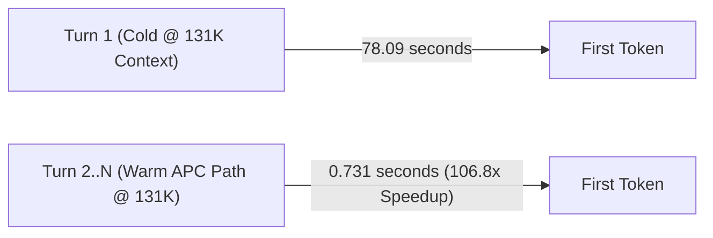

# DeepSeek-V4-Flash on three DGX Sparks

Reproducible deployment notes and benchmark evidence for serving DeepSeek-V4-Flash on
three NVIDIA DGX Spark systems with tensor parallelism (`TP=3`) over a switchless 200 GbE
RoCE ring.

The three-node deployment is working, passes all correctness and quality suites, and is
fully benchmarked with a forced 256-token assertion against matched two-node baselines
under passing fabric gates.

> [!NOTE]
> Older decode runs that requested 256 output tokens but returned only 25–26 (due to prompt
> instructions) have been retired and marked `VOID-25-token-window` in the
> [provenance index](results/INDEX.md). All current numbers use asserted 256-token windows.

## Start here

1. [**RESULT: matched 2v3 comparison**](docs/RESULT-2V3-MATCHED-2026-08-30.md) — the
   settled answer. Node count as the only variable, n=30 per cell: three nodes decode
   **+6.7 % to +20.2 %** faster across 2K–262K, all significant. **Read this first.**
2. [**RESULT: independent llama-benchy 2v3**](docs/RESULT-LLAMA-BENCHY-2V3-2026-08-30.md) —
   the same question re-run on a **third-party harness we did not write**
   ([`eugr/llama-benchy`](https://github.com/eugr/llama-benchy)). 14 of 16 cells resolved;
   **all 14 favour three nodes, none favour two.** The claim is no longer self-certified.
3. [3-Node vs 2-Node Benchmark](docs/BENCHMARK-2V3-NODES.md) — the older matrix, partly
   superseded by the above; still the reference for APC, MTP, and architectural analysis.
4. [Current handoff](docs/HANDOFF-2026-08-29-EVENING.md) — cluster state, verified findings, and
   recipe tuning conclusions.
5. [Documentation index](docs/README.md) — setup, operations, method, decisions, and
   historical investigations.
6. [Results index](results/README.md) — one readable row per frozen run bundle.
7. [Provenance index](results/INDEX.md) — status, gate coverage, raw evidence, and caveats.
8. [Repository and data map](docs/REPOSITORY-MAP.md) — what belongs on GitHub and what
   should stay local.

## The 3-Node Value: Multi-Million Token KV Cache & 100x Warm-Path Speedup

The primary operational value of the 3-node cluster (`TP=3`) is **expanded unified memory**:
- **Multi-Million Token KV Cache Pool**: 3 nodes expand KV capacity to **4,688,072 tokens** (**2.11x** the 2-node pool of 2,217,166, measured matched 2026-08-30) under Profile B (`GPU_MEMORY_UTILIZATION=0.835`, `MTP_NUM_TOKENS=2`) per the engine's init log — 4.44x headroom at 1M tokens per request, with zero KV preemption observed in any benchmark bundle to date. (The `/metrics` endpoint reports a lower figure on the same engine; see [Current evidence](#current-evidence).)
- **The Warm Multi-Turn Path (APC)**: While Turn 1 of a 131K-token coding session costs ~78s cold, **every subsequent turn responds in <0.75s (a ~107x latency reduction)** via Automatic Prefix Caching, with prefix retention confirmed across 30s and 120s human think-time pauses with zero degradation.



## 3-Node vs 2-Node Advantage Matrix

Each row cites the bundle the number actually came from. **The two arms are not
configuration-identical and were not run on the same day**: the TP=2 arm ran
`MAX_NUM_SEQS=16` and `MTP_NUM_TOKENS=5` on 2026-08-27; the current TP=3 production
shape is `MAX_NUM_SEQS=32` with `MTP_NUM_TOKENS=2`. Rows are marked accordingly. Where
no 2-node measurement exists, the cell says so rather than estimating.

> ## ✅ SETTLED 2026-08-30 — see [**RESULT-2V3-MATCHED**](docs/RESULT-2V3-MATCHED-2026-08-30.md)
>
> The matched comparison has now run. **Three nodes decode faster at every tested depth**,
> with node count as the only variable and n=30 per cell (n=12 at 262K):
>
> | Depth | TP=3 | TP=2 | Delta | p | Cliff's δ |
> |---:|---:|---:|---:|---:|---:|
> | 2K | 46.59 | 43.68 | **+6.7 %** | 6.0×10⁻⁵ | 0.604 |
> | 8K | 51.07 | 43.62 | **+17.1 %** | 3.5×10⁻¹⁰ | 0.944 |
> | 32K | 50.83 | 42.29 | **+20.2 %** | 3.0×10⁻¹¹ | **1.000** |
> | 131K | 47.38 | 39.92 | **+18.7 %** | 3.3×10⁻¹¹ | 0.998 |
> | 262K | 45.04 | 39.79 | **+13.2 %** | 4×10⁻⁵ | **1.000** |
>
> All five significant by two independent tests. **δ = 1.000 at 32K and 262K means every
> TP=3 rep beat every TP=2 rep.** Matched KV pool is **2.11×** (2,217,166 vs 4,688,072),
> not the 2.6× below.
>
> **The table below is superseded.** It is retained for provenance only. Its arms differed
> in **six** engine settings — `MAX_NUM_SEQS`, `MTP_NUM_TOKENS`, `GPU_MEMORY_UTILIZATION`,
> `LONG_PREFILL_TOKEN_THRESHOLD`, `DSPARK_MAX_INFLIGHT_PREFILLS`, `KV_CACHE_DTYPE` — of
> which only the first two were ever disclosed, so it compared *three nodes tuned against
> two nodes untuned*. At n=7 four of its five decode rows also failed a significance test.
> Its direction was right; its evidence was not.
>
> **Both "2-node wins" rows below are now REVERSED, not merely open** — each with zero
> overlap between arms:
>
> | Claim in the table below | Matched result |
> |---|---|
> | 2 nodes win deep prefill TTFT by 22.3 s at 131K | **3 nodes 14.4 % sooner at 131K, 26.6 % at 262K** (δ = −1.000). At 262K the *worst* 3-node TTFT beats the *best* 2-node one by 27 s |
> | 2 nodes win aggregate at cc=16 by 6.5 % | **3 nodes +18.6 / +22.3 / +21.9 %** at cc=4/8/16 (δ = +1.000 at all three) |
>
> **There is no measured workload where two nodes win.** Draft acceptance is near-identical
> across node counts (~66 %), so the gaps are not a speculation artefact. Not re-tested and
> still resting on their original confounded arms: **prefill throughput** and the **APC
> warm path**. TTFT figures are warm (3 warm-ups/shape, both arms), not cold-start.

> ## 🔬 INDEPENDENTLY CORROBORATED 2026-08-30 — see [**RESULT-LLAMA-BENCHY-2V3**](docs/RESULT-LLAMA-BENCHY-2V3-2026-08-30.md)
>
> The matched run above is ours. So that the 2v3 claim does not rest on our own harness, the
> same question was re-run on **[`eugr/llama-benchy`](https://github.com/eugr/llama-benchy)
> `0.4.1.dev1+ge9be34457` — a third-party harness we did not write**, the tool the DGX Spark
> community publishes with. Same session, node count the only variable, both arms asserted
> against the *live* engine before measuring.
>
> **14 of 16 cells resolved. All 14 resolved cells favour three nodes. Zero cells favour
> two nodes.**
>
> | Axis (n=10) | llama-benchy result |
> |---|---|
> | Decode, depth sweep | **+11.9 % to +20.8 %** at depth 0 / 32K / 131K; 8K inconclusive |
> | Prefill, depth sweep | **+12.5 % to +15.8 %**, resolved at **all four** depths, and the advantage *grows* with depth |
> | Decode, concurrency | **+15.4 % to +20.1 %** aggregate at cc=4/8/16; cc=1 inconclusive |
>
> **On magnitude the agreement is good, not perfect.** The like-for-like figure against our
> +17–20 % band is llama-benchy's **decode-at-depth mean of +15.4 %**, which sits **~1.6 pp
> below our band's floor** — inside the pre-registered ±5 pp tolerance, but at the low end.
> The result document's pooled **+16.7 %** mixes depth-sweep decode with concurrency decode
> and *"flatters the agreement slightly"*; quote **+15.4 %** against our depth result.
>
> **Two cells were INCONCLUSIVE** — 8K decode and cc=1 decode. **Neither favours two nodes**;
> both are one arm being noisy at n=10 (a ~2.8× variance asymmetry between arms). Their point
> deltas are not findings in either direction, and a **higher-n re-run of those two cells is
> in progress**.
>
> ⚠️ **Cross-harness absolute t/s are not comparable** and are never compared here:
> `llama-benchy --depth N` prefills *cached* context, our `decode_depth_sweep.py` does not.
> Only the 2v3 ratio computed *within* each harness may be read against the other.
>
> **Scope is 2 vs 3 only.** A 1-node arm of this checkpoint does not exist — it exceeds a
> single GB10's 128 GB.

| Capability / Metric | 3-Node (`TP=3`) | 2-Node (`TP=2`) | Delta | Source bundle |
|---|:---:|:---:|:---:|---|
| **KV cache capacity** (init log) | 4,457,627 tokens | 1,711,307 tokens | **+160% (2.6x)** — but never binds in any measured workload. Absolute values are **instrument-dependent**: `/metrics` reports a lower, group-aware figure for the same engine ([`KV-INSTRUMENT-RECONCILIATION.md`](docs/KV-INSTRUMENT-RECONCILIATION.md)). The ratio is the defensible part | [`20260825-decode-2v3`](results/20260825-decode-2v3/) (matched pair) |
| **Single-stream decode, 131K** | **47.65 tok/s** | 44.40 tok/s | **+7.3%** | [`20260827-decode-2v3-fixed`](results/20260827-decode-2v3-fixed/) |
| **Single-stream decode, 2K–32K** | **51.98 – 54.30 tok/s** | 46.29 – 46.81 tok/s | **+11.0% to +16.7%** | [`20260827-decode-2v3-fixed`](results/20260827-decode-2v3-fixed/) |
| **Cold deep prefill, 131K** | 92.73 s TTFT | **70.43 s TTFT** | **2-node wins by 22.3 s** | [`20260827-decode-2v3-fixed`](results/20260827-decode-2v3-fixed/) |
| **Aggregate throughput, $cc=16$** | 52.77 tok/s | **56.20 tok/s** | **2-node wins by 6.5%** (both arms at `MTP=5`) | [`20260827-decode-concurrency-2v3-fixed`](results/20260827-decode-concurrency-2v3-fixed/) |
| **Aggregate throughput, $cc=16$, after `MTP=2`** | **55.10 tok/s** | not measured at `MTP=2` | 3-node closed most of the gap against its **own** `MTP=5` arm (51.37 → 55.10). **This is not a 2-node comparison.** | [`20260828-issue32-mtp-concurrency-sweep`](results/20260828-issue32-mtp-concurrency-sweep/) |
| **Warm-path APC, 131K** | **0.731 s TTFT** (99.8% hit) | **not measured** | ~107x vs the 3-node cold turn (78.09 s → 0.731 s). No 2-node APC run exists | [`20260828-issue29-apc-warm-path`](results/20260828-issue29-apc-warm-path/) |
| **Proposer acceptance, long horizon** | **76.7–80.4%** ($\tau \approx 2.55$), no decay to 1,536 tokens | **not measured** | Single-arm audit for staleness decay, not a node-count comparison | [`20260829-issue36-dspark-proposer-long-horizon`](results/20260829-issue36-dspark-proposer-long-horizon/) |

### Key takeaways

1. **Decode favours three nodes at every depth — confirmed matched, 2026-08-30.**
   +6.7 % at 2K and **+13 % to +20 % from 8K through 262K**, all significant, with complete
   separation at 32K and 262K ([RESULT](docs/RESULT-2V3-MATCHED-2026-08-30.md)). The older
   "+7.3 % to +16.7 %" understated it. **TTFT and high-concurrency aggregate also favour
   three nodes** on the matched arm, reversing both previously published "2-node wins".
   **Corroborated on an independent harness the same day** — llama-benchy resolved 14 of 16
   cells and every one favours three nodes, with zero cells favouring two
   ([RESULT](docs/RESULT-LLAMA-BENCHY-2V3-2026-08-30.md)).
2. **The warm path dwarfs both.** Cold 131K costs ~78 s once; every subsequent turn
   returns in **<0.75 s** via prefix caching, retained across 2 minutes of think-time.
   For interactive coding this effect is ~100x, two orders of magnitude larger than any
   node-count delta in this table.
3. **KV capacity is 2.11x larger on three nodes** (matched measurement: 4,688,072 vs
   2,217,166 tokens) **and has never been the binding constraint** — zero preemptions in
   every bundle, on either arm. The "2.6x" figure came from arms differing in
   `GPU_MEMORY_UTILIZATION` and `MTP_NUM_TOKENS`, both of which move the pool.
4. **Drafting is healthy.** Under $K=2$ the DSpark proposer holds ~77–80% acceptance
   through 1,536 generated tokens, ruling out the community-reported staleness decay.

**What this matrix does not establish:** a current-configuration head-to-head. Closing
that needs a TP=2 arm at `MAX_NUM_SEQS=32` / `MTP_NUM_TOKENS=2` on the baked image —
the one comparison that would make every row above configuration-matched.

## Current evidence

| Question | Current answer | Evidence |
|---|---|---|
| What is the warm-path (multi-turn APC) speed? | **0.731s TTFT at 131K (106.8x speedup)**; 0.455s at 32K (37.3x speedup). 99.8% cache hit ratio with zero degradation over 2+ min idle. | [APC warm path](results/20260828-issue29-apc-warm-path/) |
| What is the KV cache capacity? | **4,660,501 tokens** per the engine's init log on the 2026-08-29 boot (Profile B, 0.835 util, `MTP=2`, 31.99 GiB KV memory, 4.44x concurrency at 1M/request). The Profile B bundle records ~2.49M because it ran at `MTP=5`. ⚠️ The live `/metrics` endpoint reports a conflicting 2,822,574 on the same engine — see the [handoff note](docs/HANDOFF-2026-08-28.md); the discrepancy is unresolved. | [Profile B](results/20260827-issue25-profile-b/), [08-28 handoff](docs/HANDOFF-2026-08-28.md) |
| Does the DSpark proposer suffer from staleness decay? | No evidence of it. Acceptance *rises* with horizon length (69.0% → 80.4%) and holds 76.7%–80.4% at 52–57 tok/s through 1,536 tokens, and `_insert_context_kv` writes all verified tokens. Caveat: each horizon is a separate generation scored cumulatively, so a late-onset decay is not fully excluded. | [Proposer long horizon](results/20260829-issue36-dspark-proposer-long-horizon/) |
| Does TP=3 serve correct output? | Yes; the attention-group padding patch is required and hermetically baked into `dsv4-3spark:0.1.1`. | [Patch](docs/patch.md), [quality suite](results/20260827-quality-suite-3node/) |
| Does three-node quality hold at long context? | Yes in the tested suite: RULER-lite 12/12, tool battery 7/7, deep-context tools 8/8, garble sweep clean through 131K. | [Quality suite](results/20260827-quality-suite-3node/) |
| What is corrected three-node decode speed? | Median 50.1–59.8 tok/s from 2K–262K with 256 asserted output tokens under winning Profile B. | [Profile B](results/20260827-issue25-profile-b/) |
| Does three-node beat two-node at cc=1 decode? | **Yes — confirmed on a matched arm, 2026-08-30.** With node count as the *only* variable and n=30 per cell: **+6.7%** at 2K, **+17.1%** at 8K, **+20.2%** at 32K, **+18.7%** at 131K, **+13.2%** at 262K. All five significant by two independent tests (p from 6×10⁻⁵ to 3×10⁻¹¹). Cliff's δ = 1.000 at 32K and 262K — every TP=3 rep beat every TP=2 rep. Supersedes the older +7.3–+16.7% figures, which were directionally right but drawn from arms differing in **six** settings at n=7. | [**RESULT**](docs/RESULT-2V3-MATCHED-2026-08-30.md), [Analysis](docs/ANALYSIS-2V3-2026-08-29.md) |
| Does three-node beat two-node at TTFT? | **Yes, at every depth — this reverses the older answer.** On the matched arm (2026-08-30): 7.9% sooner at 2K, 11.8% at 8K, 11.9% at 32K, **14.4% at 131K** (p=3.0×10⁻¹¹), **26.6% at 262K** (p=3.7×10⁻⁵). Cliff's δ = −1.000 at both deep cells; at 262K the *worst* three-node TTFT (176.8 s) beats the *best* two-node one (204.2 s) by 27 s. The old "two nodes win by 22.3 s" came from arms differing in six settings, including the Profile B long-prefill knobs. These are warm TTFTs, identically warmed on both arms. | [**RESULT**](docs/RESULT-2V3-MATCHED-2026-08-30.md) |
| Does three-node beat two-node at concurrency? | **Yes at every level — this also reverses the older answer.** Matched, n=15/cell at 8K: **+18.6%** at cc=4 (41.85 vs 35.28), **+22.3%** at cc=8 (49.83 vs 40.76), **+21.9%** at cc=16 (54.20 vs 44.45), all p=3.4×10⁻⁶ with **Cliff's δ = +1.000** — every three-node rep beat every two-node rep. Draft acceptance is near-identical (~66% both arms), so this is not a speculation artefact. The old "TP=2 leads at cc≥8" had both arms at `MTP=5` *and* the 2-node arm missing Profile B. | [**RESULT**](docs/RESULT-2V3-MATCHED-2026-08-30.md) |
| Does an independent harness agree that three nodes win? | **Yes on direction; at the low end on magnitude.** [`eugr/llama-benchy`](https://github.com/eugr/llama-benchy) `0.4.1.dev1+ge9be34457` — a third-party harness we did not write — was run on both arms the same session at n=10. **14 of 16 cells resolved and all 14 favour three nodes; zero cells favour two.** Prefill resolved on all four depths (+12.5 % to +15.8 %, growing with depth); decode resolved at 0/32K/131K (+11.9 % to +20.8 %) and at cc=4/8/16 (+15.4 % to +20.1 % aggregate). Its like-for-like decode-at-depth mean is **+15.4 %**, ~1.6 pp below our +17–20 % band's floor — inside the ±5 pp pre-registered tolerance, at the low end. Two cells (8K decode, cc=1 decode) were **INCONCLUSIVE**, neither favouring two nodes. ⚠️ **A higher-n re-run of those two found `n=10` mis-estimated the spread, and the two arms moved in *opposite* directions** — at 8K, TP=3's std rose 2.4x while TP=2's *fell* to 0.62x, converging to similar CVs. Under the measured correction the **32K and 131K decode cells would not resolve** (t falls from 2.63→1.94 and 2.36→1.29, having been only just over threshold); the concurrency cells (t = 6.7–15.0) and prefill are unaffected. Read as: **direction robust everywhere; magnitude firm at concurrency and depth 0, provisional at 32K/131K.** No cell flips direction under any inflation tested. **Cross-harness absolute t/s are not comparable** — only the within-harness 2v3 ratio is. | [**RESULT**](docs/RESULT-LLAMA-BENCHY-2V3-2026-08-30.md), [Plan](docs/PLAN-LLAMA-BENCHY-2V3.md), [bundle](results/20260830T101053Z-llama-benchy-2v3/) |
| Is the fabric below the published reference? | No. Official `nccl-tests` measured 23.92 GB/s at 16 GiB. | [Controlled NCCL run](results/20260826-nccl-controlled/) |
| Does four-HCA addressing improve decode throughput? | No measurable benefit despite doubling fabric bandwidth. | [Four-HCA result](results/20260826-four-hca-throughput/) |
| Does KV dtype change quality? | No material difference in the tested A/B; 23/24 matched cells were byte-identical. | [KV dtype A/B](results/20260826-kv-dtype-ab/) |

The corrected decode curve is a single three-node arm, not a purchasing comparison. Its
262K median also hides a severe bimodal distribution: two measured reps fell to 1.2–3.3
tok/s while five were near 50 tok/s. Read the spread, not only the median.

## How benchmark data is organized

| Location | Purpose | Edit policy |
|---|---|---|
| [`results/YYYYMMDD-<subject>/`](results/) | Frozen raw run bundle: harness, config capture, gate, logs, and per-rep output | Never rewrite; supersede with a new dated bundle |
| [`results/index.yaml`](results/index.yaml) | Machine-readable provenance and status for every run bundle | Source of truth for result status |
| [`results/INDEX.md`](results/INDEX.md) | Human-readable provenance summary | Keep aligned with the YAML |
| [`benchmarks/measurements.csv`](benchmarks/measurements.csv) | Append-only normalized observations | Add measured points with prompt and harness attribution |
| [`benchmarks/summary.csv`](benchmarks/summary.csv) | Generated headline metrics | Regenerate; do not hand-edit |
| [`docs/`](docs/) | Method, setup, operations, decisions, and interpretation | Update living docs; freeze dated reports |

Before publishing a benchmark, follow the [benchmark policy](docs/BENCHMARK-POLICY.md):
commit a passing fabric gate, force and verify the output window, publish every rep and
its spread, and capture config from the live process.

## Deployment shape

```text
rank 0 -- 200 GbE -- rank 1
   \                  /
    +---- 200 GbE ---+
          rank 2
```

The TP=3 patch pads eight attention groups to nine for sharding, then trims the padding
after gather. Without it, stock integer division silently drops groups and can produce
fluent but wrong output. See [topology](docs/topology.md), [setup](docs/setup.md), and
[patch details](docs/patch.md).

## Quick Start: Build, Deploy & Replicate

### 1. Build the Hermetic Image

Build the `dsv4-3spark:0.1.1` image across all three nodes. The build bakes in all TP=3 attention-padding and concurrency patches from [`patches/`](patches/) and runs build-time verification:

```bash
docker build -f docker/Dockerfile.runtime -t dsv4-3spark:0.1.1 .
```

### 2. Configure & Launch Cluster

```bash
# 1. Copy and configure the environment template for each rank
cp configs/3spark-live.env.example configs/3spark-live.env

# 2. Verify fabric connectivity (engine stopped)
make gate-full CONFIG=configs/3spark-live.env

# 3. Start workers on spark2 and spark1, then the head on sparkmain
docker compose up -d
```

### 3. Replicate Quality & Benchmark Suites

```bash
# Quality & parity check (asserts 12.0% empirical serving noise floor tolerance)
python scripts/logprob_parity.py

# Replicate the winning MTP=2 concurrency sweep (8K context, forced 256-token decode)
python scripts/benchmark_mtp_concurrency.py --mtp-k 2 --depth 8192 --out results/my_concurrency_run.json

# Test repository integrity & security scanner
make test
make check-sensitive
```

New runs must use a dated directory with a provenance header and include raw per-rep
evidence. See [Adding a run](results/README.md#adding-a-run).

## Scope and credit

This repository contributes the controlled comparison work, TP=3 integration notes,
failure gates, and evidence trail. It builds on Anemll's DGX Spark vLLM runtime, MiaAI-Lab
benchmark and deployment work, localaiguyy's TP=3 attention-group padding, and NVIDIA's
DGX Spark playbooks and `nccl-tests`. See [CREDITS.md](CREDITS.md) for attribution.

Security and redaction rules are in [SECURITY.md](SECURITY.md). Do not commit live `.env`
files, credentials, management addresses, usernames, serials, or unredacted environment
captures.
