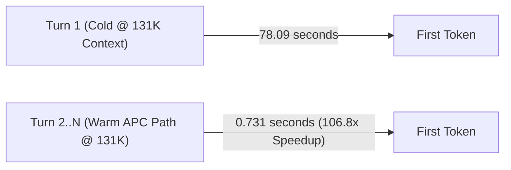

# DeepSeek-V4-Flash on three DGX Sparks

Reproducible deployment notes and benchmark evidence for serving DeepSeek-V4-Flash on
three NVIDIA DGX Spark systems with tensor parallelism (`TP=3`) over a switchless 200 GbE
RoCE ring.

The three-node deployment is working, passes all correctness and quality suites, and is
fully benchmarked with a forced 256-token assertion against matched two-node baselines
under passing fabric gates.

> [!NOTE]
> Older decode runs that requested 256 output tokens but returned only 25–26 (due to prompt
> instructions) have been retired and marked `VOID-25-token-window` in the
> [provenance index](results/INDEX.md). All current numbers use asserted 256-token windows.

## Start here

1. [Current handoff](docs/HANDOFF-2026-08-28.md) — cluster state, verified findings, and
   recipe tuning conclusions.
2. [Documentation index](docs/README.md) — setup, operations, method, decisions, and
   historical investigations.
3. [Results index](results/README.md) — one readable row per frozen run bundle.
4. [Provenance index](results/INDEX.md) — status, gate coverage, raw evidence, and caveats.
5. [Repository and data map](docs/REPOSITORY-MAP.md) — what belongs on GitHub and what
   should stay local.

## The 3-Node Value: 5.03M Token KV Cache & 100x Warm-Path Speedup

The primary operational value of the 3-node cluster (`TP=3`) is **expanded unified memory**:
- **5.03M Token KV Cache Pool**: 3 nodes expand KV capacity to over 5 million tokens under Profile B (`GPU_MEMORY_UTILIZATION=0.835`), completely eliminating KV cache preemption during heavy multi-turn agentic coding sessions.
- **The Warm Multi-Turn Path (APC)**: While Turn 1 of a 131K-token coding session costs ~78s cold, **every subsequent turn responds in <0.75s (a ~107x latency reduction)** via Automatic Prefix Caching, with prefix retention confirmed across 30s and 120s human think-time pauses with zero degradation.



## Current evidence

| Question | Current answer | Evidence |
|---|---|---|
| What is the warm-path (multi-turn APC) speed? | **0.731s TTFT at 131K (106.8x speedup)**; 0.455s at 32K (37.3x speedup). 99.8% cache hit ratio with zero degradation over 2+ min idle. | [APC warm path](results/20260828-issue29-apc-warm-path/) |
| What is the KV cache capacity? | **~5.03 million tokens** (Profile B, 0.835 util); provides 4x headroom for simultaneous long-context sessions without eviction. | [Profile B](results/20260827-issue25-profile-b/) |
| Does TP=3 serve correct output? | Yes; the attention-group padding patch is required and hermetically baked into `dsv4-3spark:0.1.1`. | [Patch](docs/patch.md), [quality suite](results/20260827-quality-suite-3node/) |
| Does three-node quality hold at long context? | Yes in the tested suite: RULER-lite 12/12, tool battery 7/7, deep-context tools 8/8, garble sweep clean through 131K. | [Quality suite](results/20260827-quality-suite-3node/) |
| What is corrected three-node decode speed? | Median 50.1–59.8 tok/s from 2K–262K with 256 asserted output tokens under winning Profile B. | [Profile B](results/20260827-issue25-profile-b/) |
| Does three-node beat two-node at cc=1 decode? | Yes across all depths (+7.3% to +16.7% advantage; 51.0 vs 44.4 tok/s at 131K). | [Matched 2v3](results/20260827-decode-2v3-fixed/), [15-rep 131K](results/20260827-tp3-131k-15rep/) |
| Does three-node beat two-node at TTFT? | Three nodes wins <32K (5–15% sooner); two nodes wins past 100K on cold start (70.4s vs 74.7s at 131K), while warm turns are parity at <0.75s. | [Matched 2v3](results/20260827-decode-2v3-fixed/), [Deep TTFT](results/20260828-issue33-deep-prefill-bt-sweep/) |
| Does three-node beat two-node at concurrency? | Under `MTP_NUM_TOKENS=2`, TP=3 achieves **55.10 tok/s at cc=16** with a 66.3% draft acceptance rate, recovering the high-concurrency gap. | [MTP sweep](results/20260828-issue32-mtp-concurrency-sweep/) |
| Is the fabric below the published reference? | No. Official `nccl-tests` measured 23.92 GB/s at 16 GiB. | [Controlled NCCL run](results/20260826-nccl-controlled/) |
| Does four-HCA addressing improve decode throughput? | No measurable benefit despite doubling fabric bandwidth. | [Four-HCA result](results/20260826-four-hca-throughput/) |
| Does KV dtype change quality? | No material difference in the tested A/B; 23/24 matched cells were byte-identical. | [KV dtype A/B](results/20260826-kv-dtype-ab/) |

The corrected decode curve is a single three-node arm, not a purchasing comparison. Its
262K median also hides a severe bimodal distribution: two measured reps fell to 1.2–3.3
tok/s while five were near 50 tok/s. Read the spread, not only the median.

## How benchmark data is organized

| Location | Purpose | Edit policy |
|---|---|---|
| [`results/YYYYMMDD-<subject>/`](results/) | Frozen raw run bundle: harness, config capture, gate, logs, and per-rep output | Never rewrite; supersede with a new dated bundle |
| [`results/index.yaml`](results/index.yaml) | Machine-readable provenance and status for every run bundle | Source of truth for result status |
| [`results/INDEX.md`](results/INDEX.md) | Human-readable provenance summary | Keep aligned with the YAML |
| [`benchmarks/measurements.csv`](benchmarks/measurements.csv) | Append-only normalized observations | Add measured points with prompt and harness attribution |
| [`benchmarks/summary.csv`](benchmarks/summary.csv) | Generated headline metrics | Regenerate; do not hand-edit |
| [`docs/`](docs/) | Method, setup, operations, decisions, and interpretation | Update living docs; freeze dated reports |

Before publishing a benchmark, follow the [benchmark policy](docs/BENCHMARK-POLICY.md):
commit a passing fabric gate, force and verify the output window, publish every rep and
its spread, and capture config from the live process.

## Deployment shape

```text
rank 0 -- 200 GbE -- rank 1
   \                  /
    +---- 200 GbE ---+
          rank 2
```

The TP=3 patch pads eight attention groups to nine for sharding, then trims the padding
after gather. Without it, stock integer division silently drops groups and can produce
fluent but wrong output. See [topology](docs/topology.md), [setup](docs/setup.md), and
[patch details](docs/patch.md).

## Quick Start: Build, Deploy & Replicate

### 1. Build the Hermetic Image

Build the `dsv4-3spark:0.1.1` image across all three nodes. The build bakes in all TP=3 attention-padding and concurrency patches from [`patches/`](patches/) and runs build-time verification:

```bash
docker build -f docker/Dockerfile.runtime -t dsv4-3spark:0.1.1 .
```

### 2. Configure & Launch Cluster

```bash
# 1. Copy and configure the environment template for each rank
cp configs/3spark-live.env.example configs/3spark-live.env

# 2. Verify fabric connectivity (engine stopped)
make gate-full CONFIG=configs/3spark-live.env

# 3. Start workers on spark2 and spark1, then the head on sparkmain
docker compose up -d
```

### 3. Replicate Quality & Benchmark Suites

```bash
# Quality & parity check (asserts 12.0% empirical serving noise floor tolerance)
python scripts/logprob_parity.py

# Replicate the winning MTP=2 concurrency sweep (8K context, forced 256-token decode)
python scripts/benchmark_mtp_concurrency.py --mtp-k 2 --depth 8192 --out results/my_concurrency_run.json

# Test repository integrity & security scanner
make test
make check-sensitive
```

New runs must use a dated directory with a provenance header and include raw per-rep
evidence. See [Adding a run](results/README.md#adding-a-run).

## Scope and credit

This repository contributes the controlled comparison work, TP=3 integration notes,
failure gates, and evidence trail. It builds on Anemll's DGX Spark vLLM runtime, MiaAI-Lab
benchmark and deployment work, localaiguyy's TP=3 attention-group padding, and NVIDIA's
DGX Spark playbooks and `nccl-tests`. See [CREDITS.md](CREDITS.md) for attribution.

Security and redaction rules are in [SECURITY.md](SECURITY.md). Do not commit live `.env`
files, credentials, management addresses, usernames, serials, or unredacted environment
captures.
