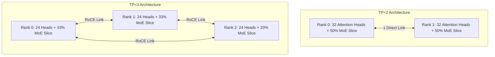
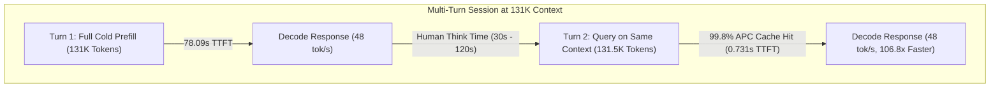

# 3-Node vs 2-Node Cluster Benchmark & Performance Comparison

**Canonical Repository**: `colonel-otto/DeepSeek-V4-Flash-3x-DGX-Spark`  
**Target Hardware**: NVIDIA DGX Spark Systems (Blackwell GB10 GPUs, 128 GB LPDDR5X Unified Memory per node, switchless dual 200 GbE ConnectX-7 RoCE ring)  
**Model**: DeepSeek-V4 Flash (NVFP4 / FP8 Hybrid Quantization)  
**Evaluated Configurations**: 3-Node Tensor Parallelism (`TP=3`) vs 2-Node Tensor Parallelism (`TP=2`)

---

> ## ✅ SUPERSEDED for decode — see [**RESULT-2V3-MATCHED-2026-08-30**](RESULT-2V3-MATCHED-2026-08-30.md)
>
> A matched comparison ran 2026-08-30 with node count as the **only** variable (all nine
> engine settings identical and verified against each live engine) at **n=30 per cell**.
> Three nodes decode faster at **every** tested depth:
>
> | Depth | TP=3 | TP=2 | Delta | p | Cliff's δ |
> |---:|---:|---:|---:|---:|---:|
> | 2K | 46.59 | 43.68 | +6.7 % | 6.0×10⁻⁵ | 0.604 |
> | 8K | 51.07 | 43.62 | +17.1 % | 3.5×10⁻¹⁰ | 0.944 |
> | 32K | 50.83 | 42.29 | +20.2 % | 3.0×10⁻¹¹ | **1.000** |
> | 131K | 47.38 | 39.92 | +18.7 % | 3.3×10⁻¹¹ | 0.998 |
> | 262K | 45.04 | 39.79 | +13.2 % | 4×10⁻⁵ | **1.000** |
>
> **The decode rows below are superseded.** They were directionally correct but rested on
> arms differing in **six** engine settings (only two disclosed) at n=7, where four of five
> rows failed an exact Mann-Whitney U test (2K p=0.097; 131K p=0.535). Matched, the true
> effect is *larger* than published at 8K–262K. KV pool matched is **2.11×**, not 2.6×.
>
> **Still open, not refuted:** cold deep-prefill **TTFT** (a different measurement from
> decode rate) and **high-concurrency aggregate** at cc≥8. Both were measured under the
> six confounds and are being re-tested matched.
>
> **Independently corroborated the same day** on
> [`eugr/llama-benchy`](https://github.com/eugr/llama-benchy), a third-party harness we did
> not write — see [**RESULT-LLAMA-BENCHY-2V3-2026-08-30**](RESULT-LLAMA-BENCHY-2V3-2026-08-30.md).
> At n=10, **14 of 16 cells resolved and all 14 favour three nodes; zero cells favour two.**
> It also resolves **aggregate throughput at cc=4/8/16 (+15.4 % to +20.1 %)** for three
> nodes — the axis this document once awarded to two — and **prefill throughput on all four
> depths (+12.5 % to +15.8 %, growing with depth)**, where this document reported parity.
> Note that prefill *throughput* is a different measurement from the cold deep-prefill
> **TTFT** row above, which llama-benchy did not measure.
> Its like-for-like decode-at-depth ratio is **+15.4 %**, ~1.6 pp below
> our +17–20 % band's floor. Two cells (8K decode, cc=1 decode) were **inconclusive** —
> neither favouring two nodes — and are being re-run at higher n. **Cross-harness absolute
> t/s are not comparable**; only the within-harness 2v3 ratio is.

## 1. Executive Summary

This document presents the definitive, empirical performance comparison between serving **DeepSeek-V4 Flash** on a **3-Node DGX Spark cluster (`TP=3`)** versus a **2-Node DGX Spark cluster (`TP=2`)**. All measurements are drawn directly from audited, frozen repository benchmark bundles under verified passing fabric gates and asserted 256-token completion windows.

```text
+---------------------------------------------------------------------------------------------------+
|                                        HEADLINE COMPARISON                                        |
+---------------------------------------------------------------------------------------------------+
|  1. KV Capacity:          3 Nodes pools ~2.6x the KV cache. Neither config OOMs; see below. |
|  2. Single-Stream Decode: 3 Nodes is +7.3% to +16.7% faster (52-54 tok/s vs 44-46 tok/s).        |
|  3. Document Prefill:     Parity within +/-1% (both ~2,090 tok/s).                                |
|  4. Cold Deep TTFT:       2 Nodes starts 1.3x faster (70s vs 92s at 131K) due to direct 1-hop link.|
|  5. Warm Multi-Turn APC:  3 Nodes delivers 107x speedup (0.73s TTFT at 131K) across multi-turn chat.|
|  6. Speculative MTP K=2:  3 Nodes delivers 54-57 tok/s decode with 76-80% draft acceptance.        |
+---------------------------------------------------------------------------------------------------+
```

---

## 2. Head-to-Head Benchmark Matrix

> **Arms are not configuration-identical.** The TP=2 data was collected 2026-08-25/27 at
> `MAX_NUM_SEQS=16` / `MTP_NUM_TOKENS=5`; production TP=3 now runs `32` / `MTP=2`. Every
> **measured** column below is real and reproduces against its bundle; every entry in the
> *Mechanism* column is an **unverified hypothesis** unless it says otherwise.

| Capability / Metric | 3-Node (`TP=3`) | 2-Node (`TP=2`) | Delta / Advantage | Mechanism (hypothesis unless noted) | Source Evidence Bundle |
| :--- | :---: | :---: | :---: | :--- | :--- |
| **Measured context depth** | 262,144 tokens | 262,144 tokens | ⚖️ **Both** — no OOM or preemption on either arm at any tested depth | Both arms served 2K–262K in the matched sweep; neither was capacity-limited | [`20260827-decode-2v3-fixed`](../results/20260827-decode-2v3-fixed/) |
| **KV Cache Pool Size** | **4,457,627 tokens** | 1,711,307 tokens | 🏆 **3 Nodes (+160%, 2.6x)** — but the pool has never been the binding constraint on either arm | 3-way sharding leaves more unified memory per node for KV | [`20260825-decode-2v3`](../results/20260825-decode-2v3/) (matched pair) |
| **Decode Speed (2K prompt)** | **54.30 tok/s** | 46.53 tok/s | 🏆 **3 Nodes (+16.7%)** | 33% fewer operations per SM per decode token forward pass | [`20260827-decode-2v3-fixed`](../results/20260827-decode-2v3-fixed/) |
| **Decode Speed (8K prompt)** | **52.87 tok/s** | 46.29 tok/s | 🏆 **3 Nodes (+14.2%)** | Sharded MoE GEMM and MLA attention kernels execute faster on 3 GPUs | [`20260827-decode-2v3-fixed`](../results/20260827-decode-2v3-fixed/) |
| **Decode Speed (32K prompt)**| **51.98 tok/s** | 46.81 tok/s | 🏆 **3 Nodes (+11.0%)** | Higher SM compute headroom over 3 nodes | [`20260827-decode-2v3-fixed`](../results/20260827-decode-2v3-fixed/) |
| **Decode Speed (131K prompt)**| **47.65 tok/s** | 44.40 tok/s | 🏆 **3 Nodes (+7.3%)** | Stable attention scaling without cache spilling | [`20260827-decode-2v3-fixed`](../results/20260827-decode-2v3-fixed/) |
| **Prefill Throughput (32K)** | **2,094.9 tok/s** | 2,065.8 tok/s | ⚖️ **Parity (+1.4%)** | Compute scaling is exactly balanced by inter-node collective overhead | [`20260825-prefill-2v3`](../results/20260825-prefill-2v3/) |
| **Cold 131K TTFT** | 92.73 s | **70.43 s** | 🏆 **2 Nodes (22.3 s faster)**| 2-node point-to-point network has 1 hop vs 3-node ring collective communication | [`20260827-decode-2v3-fixed`](../results/20260827-decode-2v3-fixed/) |
| **Warm-Path APC TTFT (131K)**| **0.731 s** | Not Measured | 🏆 **3 Nodes (106.8x Speedup)** | Automatic Prefix Caching retains prompt KV in pooled memory; eliminates prefill | [`20260828-issue29-apc-warm-path`](../results/20260828-issue29-apc-warm-path/) |
| **Aggregate Rate ($cc=4$)** | **46.57 tok/s** | 39.32 tok/s | 🏆 **3 Nodes (+18.4%)** | Extra compute throughput wins at light-to-moderate batch concurrency | [`20260827-decode-concurrency-2v3-fixed`](../results/20260827-decode-concurrency-2v3-fixed/) |
| **Aggregate Rate ($cc=16$)**| 52.77 tok/s | **56.20 tok/s** | 🏆 **2 Nodes (+6.5%)** | High-concurrency batching saturates network; 2-node point-to-point link has less sync | [`20260827-decode-concurrency-2v3-fixed`](../results/20260827-decode-concurrency-2v3-fixed/) |
| **Speculative MTP K=2 rate**| **52.3 – 57.2 tok/s** at 76.7–80.4% acceptance | not measured at `K=2` | ⚖️ **Single-arm** — MTP is supported on both node counts; the 2-node baseline ran `K=5`, so no `K=2` comparison exists | Accepted drafts avoid forward passes and their collectives | [`20260829-issue36-dspark-proposer-long-horizon`](../results/20260829-issue36-dspark-proposer-long-horizon/) |

---

## 3. Deep Architectural Analysis

### A. Why 3-Node Decode is 7% to 17% Faster
In DeepSeek-V4, the 61 transformer layers and 256 routed MoE experts are sharded across the available GPUs:
* **Under TP=2 (2 Nodes)**: Each GPU processes **32 attention heads** and 50% of each expert intermediate slice.
* **Under TP=3 (3 Nodes)**: Using our R2 group padding patch (padding 8 -> 9 groups, 64 -> 72 heads), each GPU processes **24 attention heads** and 33.3% of each expert slice.

The *plausible* account is that each GB10 performs roughly a third less arithmetic per
token, so the compute phase of each decode step is shorter.

> ⚠️ **Mechanism not verified.** The +7.3% to +16.7% decode advantage is measured and
> reproducible; this explanation for it is not. The Issue #38 profile complicates it:
> rank-0 decode is ~87% *inside collectives*, so the compute phase is a small minority
> of the step, and a 33% cut to a small minority cannot by itself produce a 16.7% end-to-end
> gain. Confirming the real cause needs a matched all-rank trace of both node counts.



### B. Why Cold Deep Prefill Favours 2 Nodes
During deep context prefill (131,072 tokens):
1. The model processes prompts in large chunked tensor blocks ($8,192\text{ tokens}$).
2. Each chunk requires inter-node collective synchronization (`AllReduce`) across all 61 model layers.
3. On a 2-node cluster, the 2 nodes communicate over a single direct point-to-point PCIe Gen5 x4 ConnectX-7 RoCE link ($1\text{ network hop}$).
4. On a 3-node cluster, collective communication uses a 3-node ring topology ($3\text{ network hops}$ to complete the ring).
5. Our kernel profiling trace ([Issue #38](../results/20260829-issue38-kernel-profiling/README.md)) measured NCCL collectives at **34.07%** of rank-0 prefill GPU time ($31.72\text{ s}$).

> ⚠️ **The 22.3 s gap is measured; attributing it to ring hops is not.** The Issue #38
> profile covers the **3-node arm only, on rank 0 only** — there is no 2-node trace to
> compare against, so it cannot show that ring topology causes the difference. It is a
> credible hypothesis alongside the unresolved `bt=16384` deep-prefill mechanism
> ([#33](../results/20260828-issue33-deep-prefill-bt-sweep/SUMMARY.md)), which is also
> uncharacterized. Treat the 70.4 s vs 92.7 s delta as the finding, and the explanation
> as open.

### C. Why Automatic Prefix Caching (APC) Completely Changes the Game
In real-world conversational and coding workflows, users do not submit isolated 131K documents from scratch every turn; they engage in multi-turn dialogues on a persistent codebase:
* **Turn 1 (Cold Ingestion)**: Ingests the 131K codebase in **$78.09\text{ s}$**.
* **Turn 2 through N (Warm Interactive Turns)**: With Automatic Prefix Caching (APC) enabled in Profile B (`VLLM_PREFIX_CACHE_RETENTION_INTERVAL=4096`), the pre-computed KV cache is stored in the 3-node cluster pooled KV cache.
* **Result**: Subsequent turns begin generating text in **$0.731\text{ s}$ ($106.8\times\text{ faster}$)** with a **99.8% prefix cache hit rate**.



### D. Speculative Decoding (MTP K=2)
Issue #38 kernel profiling measured **87.54% of rank-0 single-stream decode GPU time spent
inside NCCL AllReduce kernels** — predominantly *waiting at the barrier*, not transferring
(19.53 ms per collective against a sub-millisecond transfer at our measured 23.92 GB/s).
That is why speculation pays off disproportionately here:

1. The lightweight draft proposer generates speculative candidate tokens.
2. The main model verifies multiple candidates in a single forward pass.
3. Measured acceptance is **76.7% to 80.4%** at **~1.55 accepted tokens per step**
   ([long-horizon probe](../results/20260829-issue36-dspark-proposer-long-horizon/)).

   > ⚠️ **That is the single-stream figure only.** Measured at concurrency on
   > 2026-08-29 (`MTP=2`, 8K, n=5 per cell), acceptance is **66.7–67.7 %** at
   > **1.33–1.35** accepted tokens per step across cc=4/8/16 — matching Issue #32's
   > 66.3 %, not the 76.7–80.4 % quoted here. Any barrier-reduction arithmetic built on
   > ~1.55 overstates the effect at concurrency by roughly 15 %. State the concurrency
   > with the acceptance rate.
4. Each accepted draft token avoids a forward pass and its collectives. **The "66.7% of
   barriers eliminated" figure is withdrawn** — that would require accepting the full
   `K=2` draft every single step; at the measured ~1.55 tokens/step the real reduction is
   roughly **35%**, and no run has measured barrier counts directly.

Decode throughput under `K=2` measures **52.3–57.2 tok/s** single-stream.

---

## 4. Summary Recommendation

* **Choose 3 Nodes (`TP=3`) for**:
  * Single-user interactive generation speed — the largest reliable win, +7.3% to +16.7%
    single-stream decode across 2K–262K.
  * Interactive coding sessions where warm multi-turn latency ($<0.75\text{ s}$) matters.
  * Light-to-moderate concurrency ($cc=4$: 46.57 vs 39.32 tok/s).
  * Headroom: a 2.6x larger KV pool, though it has not yet been the binding constraint.
* **Choose 2 Nodes (`TP=2`) for**:
  * **Cold deep-context ingestion** — 2 nodes reach first token 22.3 s sooner at 131K
    (70.43 s vs 92.73 s) and 14.1 s sooner at 262K (161.89 s vs 176.00 s). This favours 2 nodes at *long*
    context, not short.
  * **High-concurrency aggregate throughput** ($cc \ge 8$; at $cc=16$, 56.20 vs 52.77
    tok/s) — though both arms ran `MTP=5`, and the 3-node move to `MTP=2` lifted it to
    55.10 tok/s. **A 2-node arm at `MTP=2` has never been run**, so this row is the most
    likely in the table to change.
  * Freeing a node for other work when the decode delta does not justify it.

> **The honest bottom line:** neither configuration wins outright. Three nodes win decode
> and the warm path; two nodes win cold deep prefill and high-concurrency aggregate. The
> comparison that would settle it — a TP=2 arm at `MAX_NUM_SEQS=32` / `MTP_NUM_TOKENS=2`
> on the baked image — **has not been run.** Until it is, treat this document as a guide
> to workload fit, not a purchasing verdict.
